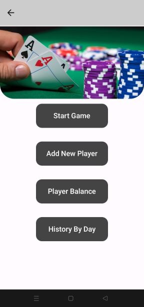
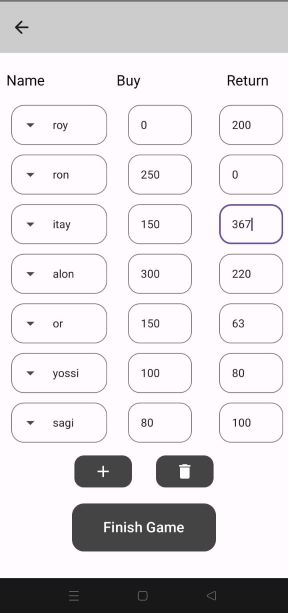
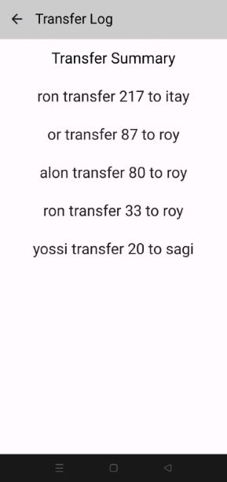
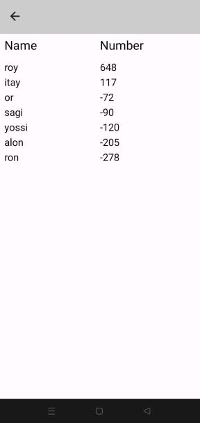
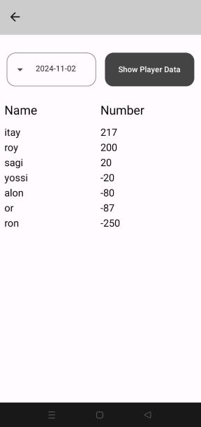

# Poker App

Welcome to the **Poker App**! This Android application calculates each player’s profit and loss at the end of each game, displays a daily game history, and provides an overview of each player’s balance. Built with Jetpack Compose and Kotlin, this app showcases game logic and an intuitive UI for smooth gameplay.

## Table of Contents
- [Features](#features)
- [Screenshots](#screenshots)
- [Installation](#installation)
- [Usage](#usage)
- [Technologies Used](#technologies-used)

---

### Features
- **Player Profit and Loss Calculation**: Calculates each player’s profit and loss at the end of each game.
- **Daily Game History**: Displays a history of games organized by day.
- **Player Balance Overview**: Provides an overview of each player’s balance over time.
- **User Interface with Jetpack Compose**: A clean, intuitive interface using the latest Android UI toolkit.

---

### Screenshots

#### Home Screen

<br><br>

#### Game Screen

<br><br>

#### Transfer Log Screen

<br><br>

####  Player Balance Screen

<br><br>

#### Balance By Day Screen

<br><br>

---

### Installation

To install the app on your Android device:

1. **Clone the Repository**
   ```bash
   git clone https://github.com/roywasker/Poker-App.git
   ```
2. **Open in Android Studio**
   - Open Android Studio and select "Open an existing project."
   - Choose the cloned repository folder.

3. **Run the App**
   - Select a connected Android device or emulator and run the app through Android Studio.

---

### Usage
1. **Start a New Game**  
   Launch the app and select "Start Game" to start a new poker session with multiple players.
   <br><br>
2. **Game and Actions**  
   For each player enter the amount of chips he bought and the amount of chips he returned.
   <br>When you’re finished playing, simply click the 'Finish Game' button.
   <br><br>
3. **Profit and Loss Calculation**  
   At the end of each game, the app automatically calculates each player's profit and loss based on their performance and updates their balance.
   <br><br>
4. **View Daily Game History**  
   Access a history of games played on each day, allowing players to review past game sessions and performance details.
   <br><br>
5. **Player Balance Overview**  
   View a comprehensive overview of each player’s balance, updated after each game. This feature gives players a clear idea of their overall standing.

---

### Technologies Used
- **Kotlin**: For programming language.
- **Jetpack Compose**: For building the UI.
- **Coroutines**: To handle asynchronous operations.
- **LiveData**: For reactive data handling.
   